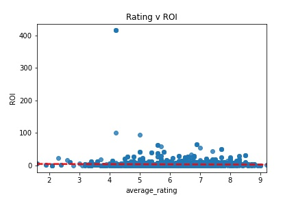

## Success at the Box Office
[!Image](<Screenshot 2024-10-04 at 1.39.25 AM.png>)

#### Author : [Sabrina Sayed](https://github.com/sabrinasayed99)

## Overview:

This project utilizes two separate box office datasets, IM.DB annd The Numbers database to assess the success of films at the box office. To gauge success, we focus on ROI and critics' ratings by genre. We will draw actionable insights from the data assist the Praveen Corporation's new movie studio in decigin what types of films to produce.

## Business Problem:
The Praveen Corporation is opening a movie studio and wants insight into what movies do the best at the box office. To measure the success, this project focuses on average ratings and ROI's of films by genre.

## Data:
 The IM.DB database presents categorical data on movie titles, release dates, directors, actors, and genres. The Numbers databases offers numerical data on domestic and worldwide gross revenue, production budgets, average ratings, number of votes, and more. This data spans films from 1960 to 2020 and covers both domestic and international films.

## Methods:
ROI was calculated based on the given gross revenue and production budget. The data was cleaned, filtered, and merged with pandas and SQL. Using statistical analyses and a linear regression model, average ratings and ROI were prioritized to measure success. Other variables were also analyzed with a multivariate regression to assess further relationships with ROI and rating.

 ## Results:
 The average ROI was found to be highest across the Mystery, Horror, Thriller, Documentary, and Biography genres. 
 

 
 The linear regression model proved to be very unreliable and revealed a weak relationship between ROI and average ratings. 

 
 
 Production budgets for the highest performing genres are skewed to the lower end of the range, proving that high budgets do not guarantee high returns. 

 
 
 The highest grossing films are mostly franchises, and thus investing in franchises is a strong predictor for success.

 

## Conclusions
My recommendations to achieve box office success are:
1. Invest in Horror & Mystery films: they tend to require lower production budgets and have higher chances of high returns.
2. Invest in franchise films: the highest grossing films in the world are all franchises.
4. Don't splurge to make big bucks: High budgets do not guarantee high returns, in fact they actually tend lower ROI. 

For the future, I recommend to look further into franchise data to see what variables lead to franchise success. I also recommend that we look into how starpower and directors can be predictors of box office success.

## Directory
[Presentation](https://www.canva.com/design/DAGSdLgdpUM/n7Qj7fD4kZpuT_7FptVAuQ/edit?utm_content=DAGSdLgdpUM&utm_campaign=designshare&utm_medium=link2&utm_source=sharebutton)

[IM.DB Dataset](https://www.imdb.com/)
[The Numbers Dataset](https://www.the-numbers.com/)

## Repo Files

### Cleaned Data folder
Cleaned Data folder contains the cleaned dataframe that was used for analysis called 'IMDB TMDB Cleaning Merging.ipynb'.
### Data
Contains the raw data files  and alternative dataframes built from the original set.
### EDA
Includes exploration of data, alternative databases, statistical analyses, regression models, and graphical representations of insights. The final version is called 'Final EDA.ipynb'
## Images
Stores images of all graphs that were created.
## Box Office Presentation.pdf
A pdf version of the presentation slides.
